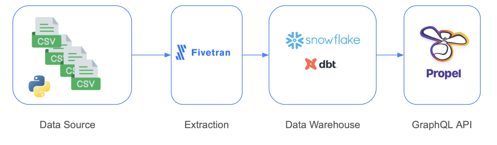
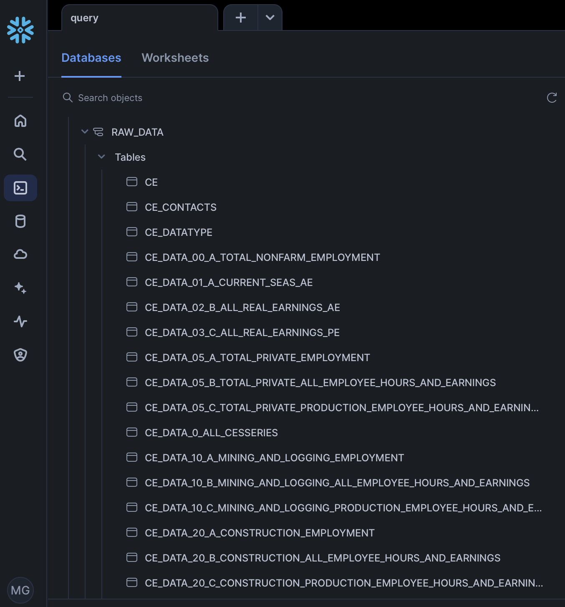
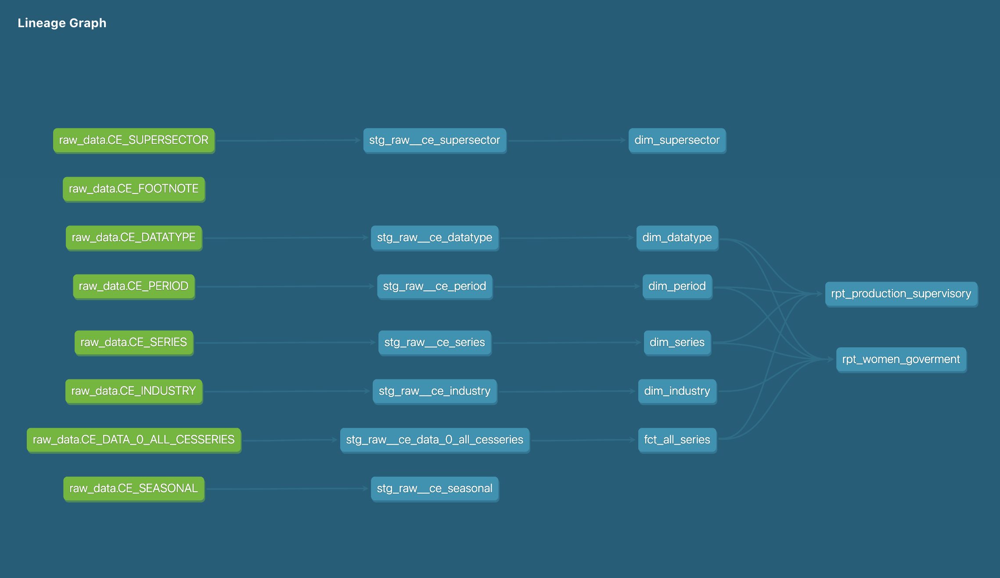
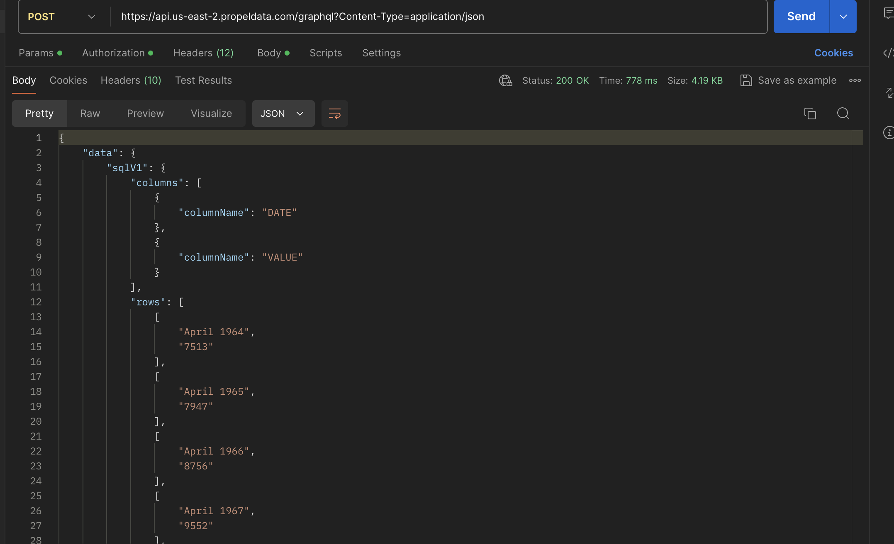
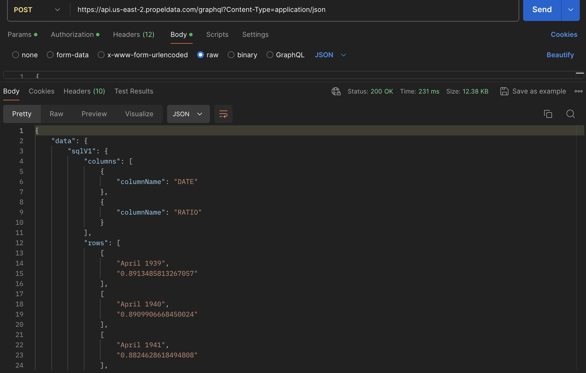

# Nimble Gravity Data Analyst Challenge

# Context

Given the CES time series data set: https://www.bls.gov/data/#employment, we need to 
study two topics:​
​
How was the evolution of women in goverment during time? 
How was the evolution of the ratio "production employees / supervisory employees" 
during time? 
 
In order to achieve this, we need to ingest the data provided as text files into a 
PostgreSQL server, create views / stored procedures / temporary tables or other 
required mechanism to expose the required data as an array of values that can be 
shown in a chart.  

Resources:​
Data set explanation: https://download.bls.gov/pub/time.series/ce/ce.txt​
Sector codes: https://download.bls.gov/pub/time.series/ce/ce.supersector​
Serie IDs explanation: https://download.bls.gov/pub/time.series/ce/ce.series​
Data: https://download.bls.gov/pub/time.series/ce/ 

# Proposed Solution
Data Architecture

## Data Preparation: 
The files were downloaded and then transformed into CSV format for easier handling. You can find the Python code in the folder [notebooks](/notebooks/download_files.ipynb)

## Data Loading: 
The files were then loaded into a Snowflake database. I used Fivetran to facilitate this process, and the files were imported into the RAW_DATA schema.

## Data Modeling:
I employed dbt (data build tool) for data modeling. The data was organized into dimension and fact tables. Subsequently, two report tables were created to address the challenge questions. The logic for these tables can be found in the 
[Reporting folder](/dbt/analytics/models/marts/reporting/rpt_women_goverment.sql) in the 
[dbt project](/dbt/analytics/models).

Here we observe the data lineage

## Data Exposure: 
To expose the data, I chose to use a GraphQL API due to its flexibility and simplicity for querying data. I used Propel for this purpose, as it is a straightforward and intuitive tool.

Example of the output of calling the "Women in goverment"  API 

Example of the output of calling the "Production Supervisory Ratio"  API 

